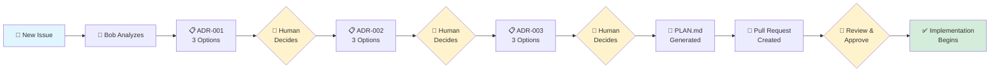

# Galaxium Travels - AI-Driven Design & Implementation Workflow

## Challenge

Software development teams face challenges in maintaining consistent design decisions and implementation quality:
- Feature requests often lack structured analysis before implementation
- Design decisions are made ad-hoc without exploring alternatives
- Implementation plans are missing or incomplete, leading to scope creep
- Knowledge about architectural choices is lost in chat history or meeting notes
- No systematic approach to breaking down features into manageable tasks

## Solution

Using **IBM Bob**, we designed and built an automated design workflow with the following capabilities:

### Automated Issue Intake & Analysis
- Automatically analyzes new GitHub issues labeled as features/enhancements
- Extracts requirements, constraints, and success criteria
- Generates structured Architecture Decision Records (ADRs)

### Three-Phase Design Decision Process
- **ADR-001**: Core architectural decision (data model, fundamental approach)
- **ADR-002**: Implementation strategy (transactions, API patterns, error handling)
- **ADR-003**: Final technical decisions (testing, integration, deployment)
- Each ADR presents 3 distinct options (A, B, C) with pros/cons analysis

### Automated Implementation Planning
- Generates comprehensive PLAN.md with ordered, atomic tasks
- Breaks down implementation into phases: Database → Services → API → Tests → Docs
- Includes acceptance criteria and testing strategy for each task
- Creates pull request with complete implementation roadmap

### Human-in-the-Loop Governance
- Humans make all architectural decisions (Bob only presents options)
- Workflow pauses at each ADR for human approval
- Supports modifications: "B with changes: [custom requirements]"
- No autonomous commits, pushes, or PR merges

## Results

A fully functional end-to-end design workflow that:
- **Reduces design time** from hours to minutes for initial analysis
- **Ensures consistent quality** through structured ADR process
- **Captures decisions** in permanent, searchable GitHub issue threads
- **Prevents scope creep** with clear, ordered implementation tasks
- **Enables async collaboration** - team members can review and decide on their schedule

### Current Capabilities

✅ Automated issue intake and requirement extraction  
✅ Three-phase ADR generation with multiple options  
✅ Comprehensive PLAN.md generation with task breakdown  
✅ GitHub Actions integration with API key authentication  
✅ Support for custom modifications at each decision point  
✅ Automatic labeling and workflow state management  

### Demo Use Case

This workflow is demonstrated with **feature implementation** (issue → design → plan), but the same pattern can be applied to:
- **PR Reviews**: Automated code review with structured feedback
- **PR Summaries**: Generate release notes and change summaries
- **Documentation**: Auto-generate API docs from code changes
- **Testing**: Generate test plans and test cases from requirements
- **Refactoring**: Analyze code and propose refactoring options
- **Security**: Automated security review with remediation options

## Workflow Diagram

**Key Steps:**
1. **Issue Created** → Bob automatically analyzes and generates first design decision (ADR-001)
2. **Human Decides** → Comments A, B, or C to select preferred option
3. **ADR-002 & ADR-003** → Process repeats for two more architectural decisions
4. **PLAN.md Generated** → Bob creates comprehensive implementation plan
5. **PR Created** → Automatic pull request with PLAN.md for review
6. **Implementation** → Task-by-task development with human approval at each step

## Technical Architecture

### Components
- **GitHub Actions Workflows**: Trigger on issue events and comments
- **Bob Shell**: AI agent with access to codebase and issue context
- **Prompt Templates**: Structured instructions in `.bob/ci-prompts/`
- **Authentication**: API key-based (BOBSHELL_API_KEY)

### Workflow Files
- `.github/workflows/issue-intake.yml` - Initial issue analysis and ADR-001
- `.github/workflows/design-comment.yml` - ADR-002, ADR-003, and PLAN.md generation

### Prompt Templates
- `.bob/ci-prompts/intake-and-adr001.md` - Issue analysis and first decision
- `.bob/ci-prompts/adr002.md` - Second architectural decision
- `.bob/ci-prompts/adr003.md` - Final architectural decision
- `.bob/ci-prompts/generate-plan.md` - Implementation plan generation

### State Management
GitHub issue labels track workflow progress:
- `design:intake-complete` - Issue analyzed, ADR-001 posted
- `design:adr-001-pending` - Waiting for human decision on ADR-001
- `design:adr-002-pending` - Waiting for human decision on ADR-002
- `design:adr-003-pending` - Waiting for human decision on ADR-003
- `design:complete` - All decisions made, PLAN.md ready

## Key Benefits

**For Product Managers:**
- Clear visibility into design decisions and rationale
- Structured approach to evaluating implementation options
- Permanent record of why decisions were made

**For Developers:**
- No more "where do I start?" - clear task breakdown
- Consistent patterns across features
- Reduced context switching with atomic tasks

**For Teams:**
- Async-friendly decision making
- Knowledge capture in GitHub (not lost in Slack/meetings)
- Scalable process that works for any feature size

## Technologies

- **AI Agent**: IBM Bob with Claude 3.5 Sonnet
- **CI/CD**: GitHub Actions
- **Backend**: Python 3.11, FastAPI, SQLAlchemy, Pydantic v2
- **Frontend**: React 18, TypeScript, Vite, Tailwind CSS
- **Database**: SQLite
- **Testing**: pytest, TestClient
- **Documentation**: Markdown, Mermaid diagrams

---

This demonstrates how Bob can accelerate software development by automating the design phase while keeping humans in control of all architectural decisions. The same workflow pattern can be adapted for PR reviews, documentation generation, testing, and other development tasks.